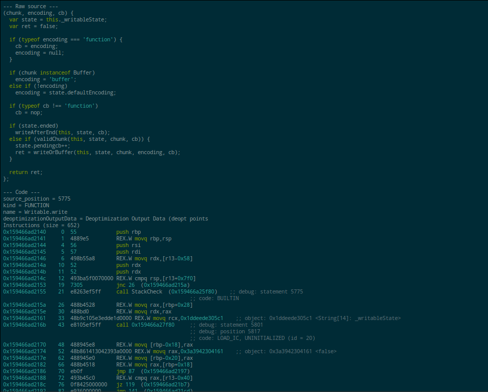

[](https://nodei.co/npm/v8-print-code-highlighter/)

# v8-print-code-highlighter

[![Dependency Status][david-badge]][david]

Dual syntax highlighter for `--print-code` / `--print-opt-code` [V8][v8] dumps. Highlights source sections as JavaScript and code sections as ASM.

[v8]: https://code.google.com/p/v8-wiki/

[david]: https://david-dm.org/eush77/v8-print-code-highlighter
[david-badge]: https://david-dm.org/eush77/v8-print-code-highlighter.png

## Example

```
$ d8 --print-code samples/source.js |v8-print-code-highlighter |bcat
```

Be forewarned though, those logs can be huge. You can use [v8-print-code-filter][v8-print-code-filter] for that, and let's also say you like solarized theme very much.

```
$ d8 --print-code samples/source.js |v8-print-code-filter --name exports.inherits |v8-print-code-highlighter -t solarized_dark |bcat
```



## CLI

```
Usage:  v8-print-code-highlighter [[--theme | -t] theme] [file]
        v8-print-code-highlighter --list-themes
```

Reads standard input by default, you can pass filename to make it read from file instead.

Spits out highlighted HTML. Use [bcat][bcat] or something similar to redirect the output to a browser tab, or just save to file and open manually.

[bcat]: http://rtomayko.github.io/bcat/

## API

### `printCodeHighlighter(sections, opts)`

- `sections` — parse tree in [v8-code-dump-parser][v8-code-dump-parser] format. Note that current implementation rewrites sections' content along the way.
- `opts.theme` — optional theme name.

Returns readable stream of HTML markup and styles.

[v8-code-dump-parser]: https://github.com/eush77/v8-code-dump-parser

## Themes

All the themes come from [highlight.js][hljs] project. Check out its [demo page][demo] for comparison.

[hljs]: https://highlightjs.org/
[demo]: https://highlightjs.org/static/demo/

## TODO

- Add ANSI output format (for the terminal).

## Related

- [v8-print-code-filter] — filter V8 dump generated by `--print-code` or `--print-opt-code` by name, source position, optimization id and so on.

[v8-print-code-filter]: https://github.com/eush77/v8-print-code-filter

## Install

```
npm install -g v8-print-code-highlighter
```

## License

MIT
